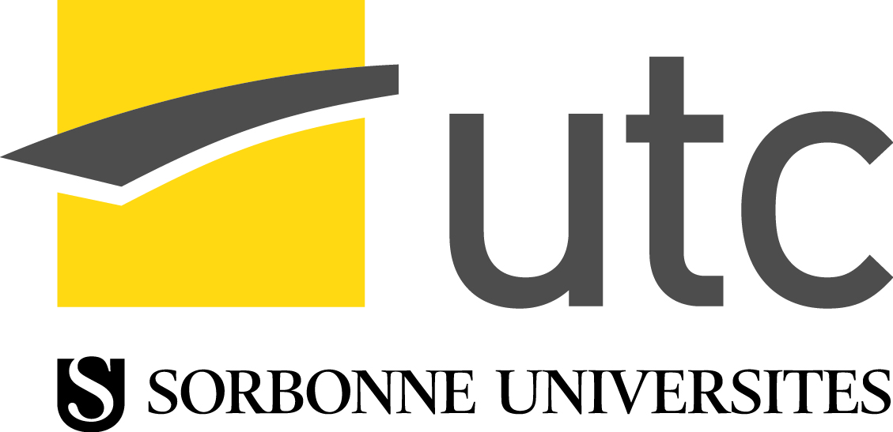

# Studies

Double-diploma at the **UTC** (*Université de Technologie de Compiègne*, french grande école)

* 2018-2019 : **Master's degree** in ***learning and optimisation of complex systems*** 
* 2013-2018 : **Engineering degree** in *computer science*, ***data mining*** option, **mathematical modelisation** label

# Projects

## Machine learning and data mining

### SY09

### SY19

### AOS1

### NF26

## Mathematical modelisation

### UV 1

### UV 2

### UV 3

